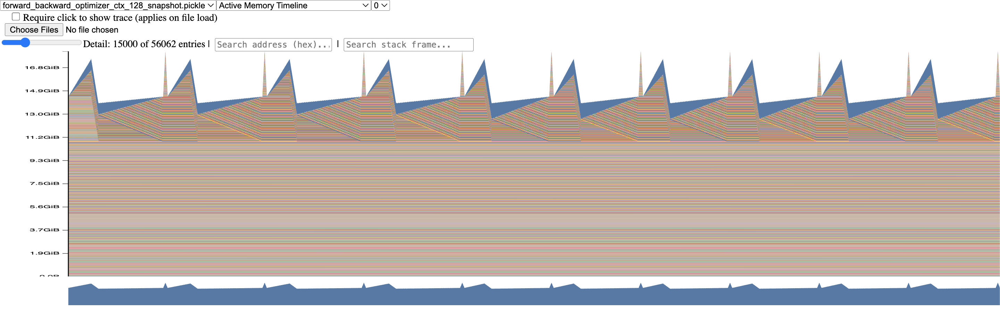
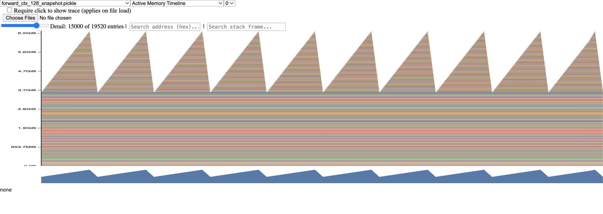

# Problem (benchmarking_script)

(a) Code in benchmark.py. Results in results/

(b) Forward + backward pass takes about 3x as long as forward only. The times are on the scale of 1/100 of a second to almost a second. The variability across the measurements is pretty small, stdev is often under 1% or only slightly above.

(c) With no warmup, the times are only slightly higher but the stdev is much larger. Potentially the first 1 or 2 steps there is a lot of kernel / caching work done and is much slower, therefore increasing the stdev. All steps after that benefit from the system having already warmed up.
With one warmup step, the variability is much lower but still slightly higher than 5 warmup steps. Also the mean times are very similar to 5 warmup steps. Could be that the first step handled much of the warmup but not all of it.

# Problem (nsys_profile)

Seems like LambdaLabs gpu instances currently don't support nsight profiling. So will skip for now.

# Problem (mixed_precision_accumulation)

```python
s = torch.tensor(0, dtype=torch.float32)
for i in range(1000):
    s += torch.tensor(0.01, dtype=torch.float32)
print(s)
```
Prints tensor(10.0001)

```python
s = torch.tensor(0, dtype=torch.float16)
for i in range(1000):
    s += torch.tensor(0.01, dtype=torch.float16)
print(s)
```
Prints tensor(9.9531, dtype=torch.float16)

```python
s = torch.tensor(0, dtype=torch.float32)
for i in range(1000):
    s += torch.tensor(0.01, dtype=torch.float16)
print(s)
```
Prints tensor(10.0021)

```python
s = torch.tensor(0, dtype=torch.float32)
for i in range(1000):
    x = torch.tensor(0.01, dtype=torch.float16)
    s += x.type(torch.float32)
print(s)
```
Prints tensor(10.0021)

fp32 for both the accumulator and incremental values performs best. The precision of the accumulator is more important than the precisions of each increment.

# Problem (benchmarking_mixed_precision)

(a)
```python
initial dtype: torch.float32
dtype after first FC layer: torch.float16
dtype after relu: torch.float16
dtype after layer norm: torch.float32
dtype of logits: torch.float16
output dtype: torch.float16
loss dtype: torch.float32
fc1.weight, param dtype: torch.float32, grad dtype: torch.float32
ln.weight, param dtype: torch.float32, grad dtype: torch.float32
ln.bias, param dtype: torch.float32, grad dtype: torch.float32
fc2.weight, param dtype: torch.float32, grad dtype: torch.float32
```

* the model's parameters are in float32
* the output of the first feed-forward layer is float16
* the output of layer norm is float32
* the model's predicted logits are float16
* the loss is in float32
* the model's gradients are in float32

(b) In fp16 mixed-precision training, the autocast library still enforces that layer norm is executed in full fp32 precision. This is because layer norm could struggle with numerical stability issues if executed in fp16, specifically when calculating the variance which requires many squaring operations. The $$\epsilon$$ also might not be able to be represented with float16. 

Fp16 has more precision bits but less exponent bits, whereas bf16 has less precision bits but more exponent bits. Since bf16 has the same number of exponent bits as fp32, if using bf16 we do not need to treat layer norm differently, and we can run layer norm in bf16 format without needing to execute that step in fp32.


(c) Results in results/forward_backward_optimizer_mixed_precision.csv and results/forward_backward_with_optimizer.csv.

Mixed precision is consistently faster. For smaller models and smaller context lengths, mixed precision is only slightly faster (e.g., 0.066775 vs. 0.072913). For larger models and larger context lengths, mixed precision is much faster (e.g., 0.723469 vs. 0.388248).


# Problem (memory_profiling)

(a)
Full training step with context length 128


Forward only with context length 128


The forward only image has consistent sharp spikes then decreases. The sharp spikes are likely the forward passes. And since there is no backward pass, the activations are freed. For the full training step, the activations are not fully freed after each forward pass. Furthermore, there are some thin sharp spikes which could correspond to the optimizer steps.


(b) Peak memory usage of forward step by context length:
* 128: 6.6 GB
* 256: 10.3 GB
* 512: 19.8 GB

Full training step:
* 128: 18 GB

(c) Mixed-precision peak memory usage of forward step by context length:
* 128: 7.2 GB
* 256: 9.6 GB
* 512: 15.8 GB

Full training step: 
* 128: 17.9 GB

Using mixed-precision can reduce memory usage at larger context lengths, but sometimes even increases memory usage at smaller context lengths. At larger context lengths, activation memory dominates so the memory savings from mixed-precision becomes significant. At smaller context lengths, the additional overhead from maintaining mixed-precision states and conversions can outweigh activation savings.

(d) For the model with context length 128, batch size of 4, and d_model = 1600:

* activation size = (B x T x d_model x bytes per element) / (1024^2)
* activation size = (4 x 128 x 1600 x 4) / (1024^2)
* activation size = 3.125 MiB

(e) When reducing detail to only 10%, the largest allocation is of size 80 MiB. 
Looking at the stacktrace, it looks like the allocation comes from tensor division operations (div_Tensor, PyNumber_TrueDivide). These could be temporary tensors created during layer norm or attention scaling operations.


# Problem (pytorch_attention)

| d_model | seq_len | fwd_time (s) | bwd_time (s) | mem after fwd (MB) | status |
|---------|---------|--------------|--------------|---------------------|--------|
| 16      | 256     | 0.0325       | 0.0608       | 21.21               | OK     |
| 16      | 1024    | 0.0725       | 0.1672       | 84.84               | OK     |
| 16      | 4096    | 0.7568       | 1.8534       | 1070.63             | OK     |
| 16      | 8192    | 2.8289       | 6.8483       | 4205.00             | OK     |
| 16      | 16384   |              |              |                     | OOM    |
| 32      | 256     | 0.0309       | 0.0621       | 22.09               | OK     |
| 32      | 1024    | 0.0652       | 0.1617       | 88.34               | OK     |
| 32      | 4096    | 0.7833       | 1.8849       | 1084.63             | OK     |
| 32      | 8192    | 2.9185       | 6.9421       | 4233.00             | OK     |
| 32      | 16384   |              |              |                     | OOM    |
| 64      | 256     | 0.0309       | 0.0621       | 23.84               | OK     |
| 64      | 1024    | 0.0682       | 0.1657       | 95.34               | OK     |
| 64      | 4096    | 0.8284       | 1.9336       | 1112.63             | OK     |
| 64      | 8192    | 3.1000       | 7.1270       | 4289.00             | OK     |
| 64      | 16384   |              |              |                     | OOM    |
| 128     | 256     | 0.0309       | 0.0582       | 27.34               | OK     |
| 128     | 1024    | 0.0741       | 0.1726       | 109.34              | OK     |
| 128     | 4096    | 0.9141       | 2.0257       | 1168.63             | OK     |
| 128     | 8192    | 3.4436       | 7.4871       | 4401.00             | OK     |
| 128     | 16384   |              |              |                     | OOM    |

This was benchmarked on an A100 with 40GB RAM.
At smaller sequence lengths, the memory after forward grows linearly with sequence length, but at larger sequence lengths, the memory after forward grows much faster. So the relationship is likely O(seq_len^2). One way to eliminate this memory cost is to recompute the attention activations during backward instead of storing it, trading off extra compute for saved memory.

# Problem (torch_compile)

(a)
Benchmarked on A100 with 40GB RAM (same as above).

| d_model | seq_len | baseline fwd (s) | compile fwd (s) | baseline bwd (s) | compile bwd (s) | compiled mem after fwd (MB) |
|---------|---------|------------------|------------------|------------------|------------------|-------------------------------|
| 16      | 256     | 0.0325           | 0.0241           | 0.0608           | 0.0468           | 21.22                          |
| 16      | 1024    | 0.0725           | 0.0491           | 0.1672           | 0.1078           | 84.88                          |
| 16      | 4096    | 0.7568           | 0.4390           | 1.8534           | 1.0870           | 1070.75                        |
| 16      | 8192    | 2.8289           | 1.7051           | 6.8483           | 3.8852           | 4205.25                        |
| 16      | 16384   | OOM              | 5.7394           | OOM              | 15.5994          | 16714.25                       |
| 32      | 256     | 0.0309           | 0.0275           | 0.0621           | 0.0417           | 22.09                          |
| 32      | 1024    | 0.0652           | 0.0485           | 0.1617           | 0.1089           | 88.38                          |
| 32      | 4096    | 0.7833           | 0.5438           | 1.8849           | 1.1057           | 1084.75                        |
| 32      | 8192    | 2.9185           | 1.9516           | 6.9421           | 3.9803           | 4233.25                        |
| 32      | 16384   | OOM              | 6.2884           | OOM              | 15.9829          | 16770.25                       |
| 64      | 256     | 0.0309           | 0.0285           | 0.0621           | 0.0434           | 23.84                          |
| 64      | 1024    | 0.0682           | 0.0701           | 0.1657           | 0.1128           | 95.38                          |
| 64      | 4096    | 0.8284           | 0.5183           | 1.9336           | 1.1511           | 1112.75                        |
| 64      | 8192    | 3.1000           | 1.7442           | 7.1270           | 4.0755           | 4289.25                        |
| 64      | 16384   | OOM              | 7.0036           | OOM              | 16.7186          | 16882.25                       |
| 128     | 256     | 0.0309           | 0.0287           | 0.0582           | 0.0456           | 27.34                          |
| 128     | 1024    | 0.0741           | 0.0763           | 0.1726           | 0.1218           | 109.38                         |
| 128     | 4096    | 0.9141           | 0.6079           | 2.0257           | 1.2495           | 1168.75                        |
| 128     | 8192    | 3.4436           | 2.0895           | 7.4871           | 4.4394           | 4401.25                        |
| 128     | 16384   | OOM              | 8.3827           | OOM              | 18.1259          | 17106.25                       |


(b)

Full end-to-end training step (forward + backward + optimizer step), baseline vs. torch.compile

| d_model | context_length | baseline mean_time (s) | compiled mean_time (s) |
|---------|-----------------|-------------------------|--------------------------|
| 768     | 128             | 0.072913                | 0.064861                 |
| 768     | 256             | 0.120324                | 0.100844                 |
| 768     | 512             | 0.241405                | 0.189355                 |
| 1024    | 128             | 0.219400                | 0.201784                 |
| 1024    | 256             | 0.369397                | 0.320342                 |
| 1024    | 512             | 0.723469                | 0.581659                 |
| 1280    | 128             | 0.518490                | 0.487466                 |
| 1280    | 256             | OOM                     | 0.750421                 |
| 1280    | 512             | OOM                     | OOM                       |
| 1600    | 128             | OOM                     | OOM                       |
| 1600    | 256             | OOM                     | OOM                       |
| 1600    | 512             | OOM                     | OOM                       |
| 2560    | 128             | OOM                     | OOM                       |
| 2560    | 256             | OOM                     | OOM                       |
| 2560    | 512             | OOM                     | OOM                       |


# Problem (flash_forward and flash_backward)

Key learnings:

* Q tile size equates to how many rows of Q are processed by a single thread block. Each GPU thread block is assigned to one tile of Q_TILE_SIZE query rows at a time.
* Online softmax rescales previously-accumulated partial results whenever a new larger max is seen. This avoids having to materialize entire row in memory at once.
* Mixed precision requires careful dtype management: when benchmarking with bf16, the intermediate accumulators are still kept in fp32 for numerical stability. However, they must explicitly be cast down before matmuls with lower precision elements. This was the cause of some "block element type(bf16) and value element type(fp32) mismatch" errors.


# Problem (flash_benchmarking)

Benchmarked on H100 with 80GB SXM5.

| seq_len | d_model | precision | pytorch_fwd (ms) | flash_fwd (ms) | fwd_speedup | pytorch_fwd_bwd (ms) | flash_fwd_bwd (ms) | fwd_bwd_speedup | status |
|---------|---------|-----------|------------------|-----------------|-------------|------------------------|----------------------|-------------------|--------|
| 128     | 16      | bf16      | 0.0751           | 0.0074          | 10.13       | 0.4959                 | 0.3161               | 1.57              | OK     |
| 128     | 16      | fp32      | 0.0718           | 0.0077          | 9.26        | 0.4945                 | 0.3290               | 1.50              | OK     |
| 128     | 32      | bf16      | 0.0922           | 0.0090          | 10.30       | 0.5200                 | 0.3387               | 1.54              | OK     |
| 128     | 32      | fp32      | 0.0934           | 0.0094          | 9.98        | 0.5683                 | 0.3462               | 1.64              | OK     |
| 128     | 64      | bf16      | 0.0936           | 0.0094          | 9.93        | 0.5214                 | 0.3292               | 1.58              | OK     |
| 128     | 64      | fp32      | 0.0908           | 0.0103          | 8.82        | 0.5124                 | 0.3365               | 1.52              | OK     |
| 128     | 128     | bf16      | 0.0923           | 0.0100          | 9.20        | 0.5297                 | 0.3362               | 1.58              | OK     |
| 128     | 128     | fp32      | 0.0962           | 0.0124          | 7.77        | 0.5424                 | 0.3602               | 1.51              | OK     |
| 256     | 16      | bf16      | 0.1007           | 0.0097          | 10.43       | 0.5454                 | 0.3555               | 1.53              | OK     |
| 256     | 16      | fp32      | 0.1069           | 0.0103          | 10.39       | 0.5652                 | 0.3732               | 1.51              | OK     |
| 256     | 32      | bf16      | 0.1051           | 0.0119          | 8.87        | 0.5520                 | 0.3406               | 1.62              | OK     |
| 256     | 32      | fp32      | 0.1081           | 0.0133          | 8.13        | 0.5743                 | 0.3554               | 1.62              | OK     |
| 256     | 64      | bf16      | 0.1004           | 0.0129          | 7.79        | 0.5456                 | 0.3497               | 1.56              | OK     |
| 256     | 64      | fp32      | 0.1060           | 0.0143          | 7.40        | 0.5657                 | 0.3500               | 1.62              | OK     |
| 256     | 128     | bf16      | 0.1009           | 0.0154          | 6.54        | 0.5525                 | 0.3434               | 1.61              | OK     |
| 256     | 128     | fp32      | 0.1063           | 0.0197          | 5.40        | 0.5725                 | 0.3583               | 1.60              | OK     |
| 512     | 16      | bf16      | 0.1024           | 0.0150          | 6.85        | 0.5572                 | 0.3773               | 1.48              | OK     |
| 512     | 16      | fp32      | 0.1106           | 0.0162          | 6.83        | 0.6050                 | 0.3907               | 1.55              | OK     |
| 512     | 32      | bf16      | 0.1063           | 0.0190          | 5.61        | 0.5674                 | 0.3402               | 1.67              | OK     |
| 512     | 32      | fp32      | 0.1089           | 0.0213          | 5.12        | 0.5712                 | 0.3506               | 1.63              | OK     |
| 512     | 64      | bf16      | 0.1028           | 0.0210          | 4.91        | 0.5497                 | 0.3434               | 1.60              | OK     |
| 512     | 64      | fp32      | 0.1082           | 0.0238          | 4.55        | 0.5742                 | 0.3540               | 1.62              | OK     |
| 512     | 128     | bf16      | 0.1060           | 0.0249          | 4.26        | 0.5462                 | 0.3427               | 1.59              | OK     |
| 512     | 128     | fp32      | 0.1085           | 0.0337          | 3.22        | 0.5743                 | 0.3574               | 1.61              | OK     |
| 1024    | 16      | bf16      | 0.1093           | 0.0199          | 5.50        | 0.5642                 | 0.3556               | 1.59              | OK     |
| 1024    | 16      | fp32      | 0.1131           | 0.0278          | 4.07        | 0.5871                 | 0.3764               | 1.56              | OK     |
| 1024    | 32      | bf16      | 0.1081           | 0.0331          | 3.26        | 0.5390                 | 0.3380               | 1.59              | OK     |
| 1024    | 32      | fp32      | 0.1080           | 0.0368          | 2.94        | 0.5570                 | 0.3457               | 1.61              | OK     |
| 1024    | 64      | bf16      | 0.1043           | 0.0371          | 2.81        | 0.5406                 | 0.3365               | 1.61              | OK     |
| 1024    | 64      | fp32      | 0.1084           | 0.0429          | 2.52        | 0.5600                 | 0.3511               | 1.60              | OK     |
| 1024    | 128     | bf16      | 0.1055           | 0.0445          | 2.37        | 0.5525                 | 0.3487               | 1.58              | OK     |
| 1024    | 128     | fp32      | 0.1119           | 0.0612          | 1.83        | 0.6097                 | 0.3709               | 1.64              | OK     |
| 2048    | 16      | bf16      | 0.1074           | 0.0441          | 2.43        | 0.5681                 | 0.3502               | 1.62              | OK     |
| 2048    | 16      | fp32      | 0.1103           | 0.0531          | 2.08        | 0.5601                 | 0.3496               | 1.60              | OK     |
| 2048    | 32      | bf16      | 0.1046           | 0.0624          | 1.68        | 0.5364                 | 0.3369               | 1.59              | OK     |
| 2048    | 32      | fp32      | 0.1104           | 0.0691          | 1.60        | 0.5595                 | 0.3474               | 1.61              | OK     |
| 2048    | 64      | bf16      | 0.1040           | 0.0701          | 1.48        | 0.5496                 | 0.3513               | 1.56              | OK     |
| 2048    | 64      | fp32      | 0.1075           | 0.0799          | 1.34        | 0.5687                 | 0.3543               | 1.61              | OK     |
| 2048    | 128     | bf16      | 0.1056           | 0.0848          | 1.24        | 0.5552                 | 0.3512               | 1.58              | OK     |
| 2048    | 128     | fp32      | 0.1122           | 0.1170          | 0.96        | 0.5849                 | 0.3745               | 1.56              | OK     |
| 4096    | 16      | bf16      | 0.2021           | 0.0866          | 2.33        | 0.5897                 | 0.3625               | 1.63              | OK     |
| 4096    | 16      | fp32      | 0.3033           | 0.1059          | 2.87        | 0.7928                 | 0.4583               | 1.73              | OK     |
| 4096    | 32      | bf16      | 0.2001           | 0.1243          | 1.61        | 0.5751                 | 0.3558               | 1.62              | OK     |
| 4096    | 32      | fp32      | 0.3181           | 0.1500          | 2.12        | 0.8230                 | 0.5325               | 1.55              | OK     |
| 4096    | 64      | bf16      | 0.1987           | 0.1479          | 1.34        | 0.5777                 | 0.3732               | 1.55              | OK     |
| 4096    | 64      | fp32      | 0.3525           | 0.1899          | 1.86        | 0.9318                 | 0.6668               | 1.40              | OK     |
| 4096    | 128     | bf16      | 0.2012           | 0.1961          | 1.03        | 0.6243                 | 0.4256               | 1.47              | OK     |
| 4096    | 128     | fp32      | 0.4368           | 0.2882          | 1.52        | 1.1829                 | 0.9860               | 1.20              | OK     |
| 8192    | 16      | bf16      | 0.7452           | 0.2631          | 2.83        | 1.8050                 | 0.9943               | 1.82              | OK     |
| 8192    | 16      | fp32      | 1.0677           | 0.3449          | 3.10        | 2.6674                 | 1.5198               | 1.76              | OK     |
| 8192    | 32      | bf16      | 0.7441           | 0.3469          | 2.14        | 1.7973                 | 1.0900               | 1.65              | OK     |
| 8192    | 32      | fp32      | 1.1039           | 0.4303          | 2.57        | 2.7526                 | 1.6787               | 1.64              | OK     |
| 8192    | 64      | bf16      | 0.7456           | 0.4036          | 1.85        | 1.7968                 | 1.1499               | 1.56              | OK     |
| 8192    | 64      | fp32      | 1.2485           | 0.5789          | 2.16        | 3.1553                 | 2.2227               | 1.42              | OK     |
| 8192    | 128     | bf16      | 0.7514           | 0.5607          | 1.34        | 1.8168                 | 1.3031               | 1.39              | OK     |
| 8192    | 128     | fp32      | 1.5957           | 0.8863          | 1.80        | 4.0947                 | 3.3489               | 1.22              | OK     |
| 16384   | 16      | bf16      | 2.7698           | 0.9631          | 2.88        | 6.6251                 | 3.6935               | 1.79              | OK     |
| 16384   | 16      | fp32      | 3.7792           | 1.2654          | 2.99        | 9.6007                 | 5.5699               | 1.72              | OK     |
| 16384   | 32      | bf16      | 2.7780           | 1.2632          | 2.20        | 6.6391                 | 4.0038               | 1.66              | OK     |
| 16384   | 32      | fp32      | 3.9258           | 1.6342          | 2.40        | 9.9368                 | 6.2630               | 1.59              | OK     |
| 16384   | 64      | bf16      | 2.7906           | 1.4771          | 1.89        | 6.6707                 | 4.2517               | 1.57              | OK     |
| 16384   | 64      | fp32      | 4.6800           | 2.4018          | 1.95        | 11.9400                | 8.7546               | 1.36              | OK     |
| 16384   | 128     | bf16      | 2.7988           | 2.3538          | 1.19        | 6.7589                 | 5.1771               | 1.31              | OK     |
| 16384   | 128     | fp32      | 5.9203           | 3.5205          | 1.68        | 15.5392                | 12.9003              | 1.20              | OK     |
| 32768   | 16      | bf16      | 10.4137          | 3.6808          | 2.83        | 25.2055                | 14.6860              | 1.72              | OK     |
| 32768   | 16      | fp32      | 14.2075          | 4.8239          | 2.95        | 36.7241                | 21.2812              | 1.73              | OK     |
| 32768   | 32      | bf16      | 10.4275          | 4.9286          | 2.12        | 25.2212                | 15.9445              | 1.58              | OK     |
| 32768   | 32      | fp32      | 14.8446          | 6.3941          | 2.32        | 38.2990                | 24.1688              | 1.58              | OK     |
| 32768   | 64      | bf16      | 10.4234          | 5.8008          | 1.80        | 25.2266                | 16.8332              | 1.50              | OK     |
| 32768   | 64      | fp32      | 17.3691          | 8.7943          | 1.98        | 45.2809                | 32.6208              | 1.39              | OK     |
| 32768   | 128     | bf16      | 10.4475          | 8.4067          | 1.24        | 25.3332                | 19.5154              | 1.30              | OK     |
| 32768   | 128     | fp32      | 23.1913          | 14.1306         | 1.64        | 61.4872                | 51.7044              | 1.19              | OK     |
| 65536   | 16      | bf16      | 41.4746          | 14.3544         | 2.89        | 87.3917                | 57.9517              | 1.51              | OK     |
| 65536   | 16      | fp32      | —                | —               | —           | —                      | —                    | —                 | OOM    |
| 65536   | 32      | bf16      | 41.6124          | 19.3344         | 2.15        | 87.3821                | 63.0816              | 1.39              | OK     |
| 65536   | 32      | fp32      | —                | —               | —           | —                      | —                    | —                 | OOM    |
| 65536   | 64      | bf16      | 41.8318          | 22.7662         | 1.84        | 87.9212                | 66.9465              | 1.31              | OK     |
| 65536   | 64      | fp32      | —                | —               | —           | —                      | —                    | —                 | OOM    |
| 65536   | 128     | bf16      | 41.9562          | 32.3046         | 1.30        | 88.4797                | 77.3745              | 1.14              | OK     |
| 65536   | 128     | fp32      | —                | —               | —           | —                      | —                    | —                 | OOM    |


Speedup tends to decrease as d_model increases. This is because as d_model increases, attention becomes more compute-bound and less memory-bound. Usually the forward speedup 
is also larger than the forward + backward speedup, since the backward pass always uses plain pytorch whereas the forward benefits from triton.


# Problem (distributed_communication_single_node)

| data_size (MB) | num_processes | backend | total_time_10_steps (s) | avg_time_per_call (s) |
|----------------|---------------|---------|--------------------------|-------------------------|
| 1              | 2             | gloo    | 0.004235                 | 0.000424                |
| 1              | 4             | gloo    | 0.009877                 | 0.000988                |
| 1              | 6             | gloo    | 0.011217                 | 0.001122                |
| 10             | 2             | gloo    | 0.028544                 | 0.002854                |
| 10             | 4             | gloo    | 0.049638                 | 0.004964                |
| 10             | 6             | gloo    | 0.060519                 | 0.006052                |
| 100            | 2             | gloo    | 0.356358                 | 0.035636                |
| 100            | 4             | gloo    | 0.541723                 | 0.054172                |
| 100            | 6             | gloo    | 0.627819                 | 0.062782                |
| 1024           | 2             | gloo    | 3.559723                 | 0.355972                |
| 1024           | 4             | gloo    | 5.336685                 | 0.533669                |
| 1024           | 6             | gloo    | 6.362074                 | 0.636207                |

Increasing the number of processes increases the total time taken because of latency of more communication rounds. Looks like gloo uses a ring-allreduce
algorithm that needs ~2(P-1) sequential hops. Another observation is that the relative slowdown from 2 to 6 processes is larger at smaller data sizes (~2.6x) 
and less at larger data sizes (~1.8x). This could be because at larger data sizes the total time is dominated more by the data size and not the latency term
(more amortization).


# Problem (naive_ddp_benchmarking)

Benchmarked on 2× NVIDIA RTX PRO 6000, each with 96GB of VRAM.
Used a batch size of 4. Used 5 warmup steps and benchmarked 10 steps.

Total training time for 10 steps: 6.839635513955727, total gradient sync time: 3.7077622688375413, fraction: 0.5420993942253428

Total training time for 10 steps: 6.839746640063822, total gradient sync time: 3.7148574516177177, fraction: 0.5431279325257367


# Problem (minimal_ddp_flat_benchmarking)

Benchmarked on 2× NVIDIA RTX PRO 6000, each with 96GB of VRAM.
Used a batch size of 4. Used 5 warmup steps and benchmarked 10 steps.

Total training time for 10 steps: 6.984030875144526, total gradient sync time: 3.85113317030482, fraction: 0.5514198375053898

Total training time for 10 steps: 6.984072948107496, total gradient sync time: 3.85996251180768, fraction: 0.5526807266315324


Compared to individually communicating gradients, both total training time and total gradient sync time are only slightly higher, 
and the fraction of time for gradient syncing is about the same.


# Problem (ddp_overlap_individual_parameters_benchmarking)

Benchmarked on 2× NVIDIA RTX PRO 6000, each with 96GB of VRAM.
Used a batch size of 4. Used 5 warmup steps and benchmarked 10 steps.

Total training time for 10 steps: 6.190566919045523, total gradient sync time: 0.19393182988278568, fraction: 0.031326990309424936

Total training time for 10 steps: 6.190588270081207, total gradient sync time: 0.19423204031772912, fraction: 0.03137537691796473


Overlapping backward pass computation with individual parameter gradients communication slightly reduces total training time from ~6.9s for 10 iterations to ~6.2s.
The total gradient sync time drastically reduces, from ~3.8s to ~0.19s, taking up only about 3% of total training time.


# Problem (optimizer_state_sharding_accounting)

(a) Benchmarked on 2× NVIDIA RTX PRO 6000, each with 96GB of VRAM, with batch size of 4

Without optimizer state sharding:
* Peak memory after model init: 13762217984
* Peak memory before optimizer step: 27412481536
* Peak memory after optimizer step: 68690606592

Total training time for 1 step: 0.5542899090796709

With optimizer state sharding:
* Peak memory after model init: 13762217984
* Peak memory before optimizer step: 27412481536
* Peak memory after optimizer step: 47739075072

Total training time for 1 step: 0.6194548720959574


(b) Used 5 warmup steps and benchmarked 10 steps.

With optimizer state sharding:
* Total training time for 10 steps: 4.276428773067892

Without optimizer state sharding:
* Total training time for 10 steps: 6.411994853056967


# Problem (alternate_ring_all_reduce)

The modulo notations are just describing which tensor is being passed around at each step. With 4 GPUs:

At step t=1: each GPU sends its own tensor i.

At step t=2:
* GPU0 sends $x^(3)$
* GPU1 sends $x^(0)$
* GPU2 sends $x^(1)$
* GPU3 sends $x^(2)$

Each round:
* data sent = S
* bandwidth = W

Time per round = S / W

Number of rounds: N − 1

Therefore total time = (N − 1) * (S / W)

The algorithm takes (N − 1) * (S / W) seconds because it performs N−1 communication steps, and in each step every device sends an entire tensor of size S at bandwidth W.


# Problem (data_parallel_calcs)

(a)

Each device processes:

$B_i = B / N_{\text{DP}}$

The backward pass has 6 matrix multiplications:

* $dz = dyW_3^T$: $2B_iDD_{\text{FF}}$
* $dx = dx_1W_1^T+dx_2W_2^T$: $4B_iDD_{\text{FF}}$
* $dW_3, dW_2, dW_1$: $3(2B_iDD_{\text{FF}})$

Total: $(2+4+6)B_iDD_{\text{FF}} = 12B_iDD_{\text{FF}}$

Divide by $N_{\text{DP}}$:

$12BDD_{\text{FF}} / N_{\text{DP}}$

(b)

Gradients: $dW_1, dW_2, dW_3$

Each has $DD_{FF}$ parameters, so total gradient size in FP16:

$S = 3(DD_{\text{FF}})(2) = 6DD_{\text{FF}}$ bytes

Ring all-reduce time:

$T_{comm} = 2 \cdot (N_{\text{DP}}-1)/N_{\text{DP}} \cdot S/W$

Therefore:

$T_{comm} = 12(N_{\text{DP}}-1)DD_{\text{FF}} / (N_{\text{DP}}W)$

(c)

Communication dominates when:

$T_{comm} > T_{compute}$

$12(N_{\text{DP}}-1)DD_{\text{FF}} / (N_{\text{DP}}W) > 12BDD_{\text{FF}} / (N_{\text{DP}}C)$

$(N_{\text{DP}}-1)/W > B/C$

Therefore:

$N_{\text{DP}} > 1 + BW/C$

At this point, communication becomes the bottleneck because compute decreases with batch sharding while gradient communication remains roughly constant.

